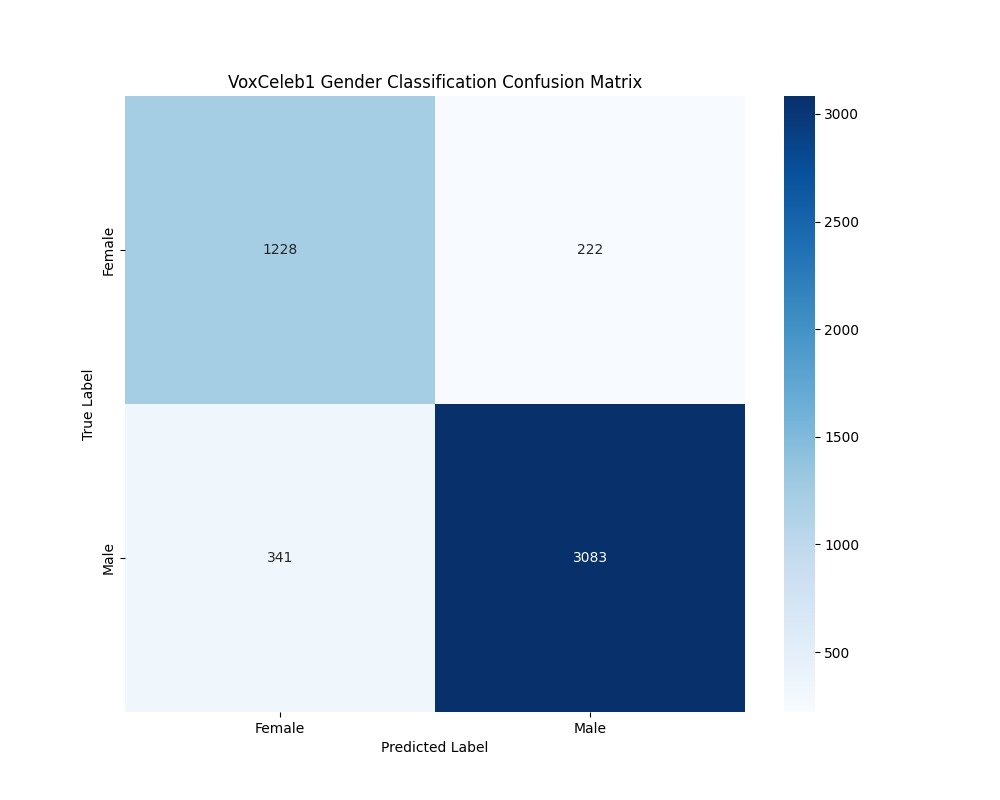
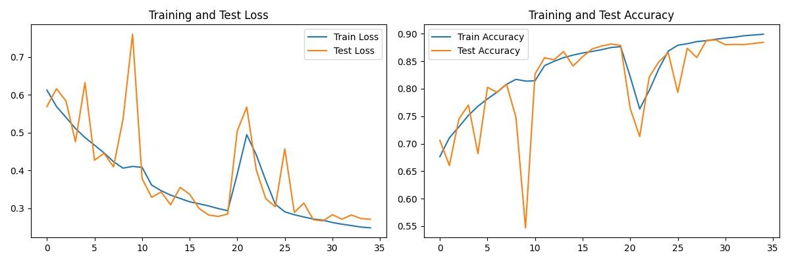
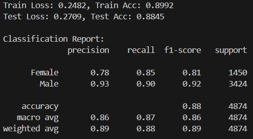

# Gender Audio Classification Model

## Overview
This project implements a gender classification model trained on the [VoxCeleb1 dataset](https://huggingface.co/datasets/ProgramComputer/voxceleb/tree/main/vox1). The model processes audio samples to determine the gender of the speaker using deep learning techniques.

## Features
- **Preprocessing Pipeline:** Converts raw audio into a suitable format for model training.
- **Deep Learning Model:** Trained using PyTorch to classify gender from speech.
- **Pretrained Model:** `best_model.pth` contains the best-performing model with the highest accuracy.
- **Evaluation Metrics:** Includes confusion matrix and train vs test accuracy/loss curves.

## Dataset
The dataset was obtained from [VoxCeleb1](https://huggingface.co/datasets/ProgramComputer/voxceleb/tree/main/vox1), which consists of celebrity voice recordings with labeled gender information.

## File Structure
```plaintext
├── preprocess_VoxCeleb1.py  # Prepares dataset for training
├── model.py                 # Contains training and testing code
├── best_model.pth           # Best performing trained model
├── Confusion_Matrix.jpg     # Confusion matrix visualization
├── test_vs_train_curves.jpg # Train vs Test accuracy/loss curves
├── result.jpg               # Accuracy and other statistics
├── README.md                # Project documentation
```

## Installation
1. Clone the repository:
   ```bash
   git clone https://github.com/yourusername/Gender_Audio_Classification.git
   cd Gender_Audio_Classification
   ```
2. Install dependencies:
   ```bash
   pip install -r requirements.txt
   ```

## Usage
### 1. Preprocess the Data
Run the preprocessing script to prepare the dataset:
```bash
python preprocess_VoxCeleb1.py
```

### 2. Train the Model
Train the deep learning model using:
```bash
python model.py --train
```

### 3. Evaluate the Model
Test the model performance:
```bash
python model.py --test
```
The results will include accuracy, loss curves, and a confusion matrix.

## Results
- **Best Accuracy:** Achieved on the validation set using `best_model.pth`
- **Confusion Matrix:** 
- **Train vs Test Curves:** 
- **Performance Metrics:** 
